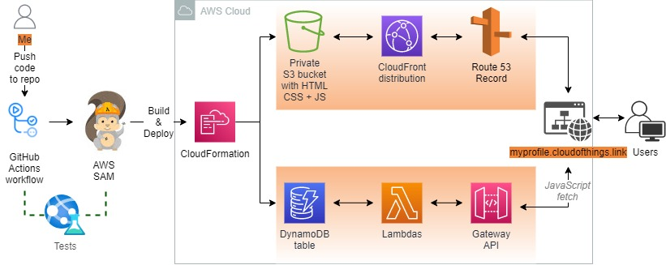

<br />

<p align="center">
  <a href="img/">
    
  </a>
  <h3 align="center">Cloud Resume Challenge using SAM</h3>
<p align="center">
    Read my <a href="https://dev.to/cloudedthings/cloud-resume-challenge-aws-1mhh"> DEV post </a> 
    <br />
    about my experiences with this challenge
    <br />
  </p>


</p>

<details open="open">
  <summary><h2 style="display: inline-block">Lab Details</h2></summary>
  <ol>
    <li><a href="#services-covered">Services covered</a>
    <li><a href="#lab-description">Lab description</a></li>
    </li>
    <li><a href="#lab-date">Lab date</a></li>
    <li><a href="#prerequisites">Prerequisites</a></li>    
    <li><a href="#lab-steps">Lab steps</a></li>
    <li><a href="#lab-files">Lab files</a></li>
    <li><a href="#acknowledgements">Acknowledgements</a></li>
  </ol>
</details>

---

## Services Covered
*  **AWS SAM**

---

## Lab description
It's time to start deploying the Cloud Resume Challenge resources using the AWS SAM. I already have [deployed](https://cloudofthings.net/cloud-resume-challenge-part-one/) everything through a manual setup in the console and it's working fine. What I'm actually gonna do is to deploy those resources as Infrastructure as Code. But I don't want to downtime my running profile page so I thought that I'll make a mirror page for now with similar setup under another domain.

### Lab date
27-10-2021

---

### Prerequisites
* AWS account,
* SAM CLI installed
* Recommended: [aws-vault](https://github.com/99designs/aws-vault)

---

### Lab steps
1. In an empty folder run 

   ```
   sam init
   ```

   This will initiate a sample application in your folder and set-up SAM. Choose AWS Quick Start as Zip, I'll use Python for my Lambda code and Hello World example - stack includes API Gateway, IAM Role and Lambda function.

2. Next run (aws-vault is not necessary if you want to use your default AWS CLI credentials):

   ```bash
   aws-vault exec <<YOUR-USER>> --no-session -- sam deploy --guided 
   ```

   This will deploy the stack in AWS.

   

3. Ok, now that my sample resources and SAM are deployed it's time to create CRC specific resources using updating that existing stack. I wanted my site to be hosted under myprofile.cloudofthings.net domain so the S3 bucket for the frontend code needs to be called accordingly. But since I'm using CloudFront domain name later on so it doesn't really matter. Then you need to run

   ```bash
   sam build
   ```

   ```
   aws-vault exec <<YOUR-USER>> --no-session -- sam deploy
   ```

4. The bucket configuration needs to be public and set-up for website hosting so I added the properties and Bucket Policy to the template:

   ```yaml
   MyWebsite:
       Type: AWS::S3::Bucket
       Properties:
         AccessControl: PublicRead
         WebsiteConfiguration:
           IndexDocument: index.html
         BucketName: myprofile.cloudofthings.net
         
   BucketPolicy:
       Type: AWS::S3::BucketPolicy
       Properties:
         PolicyDocument:
           Id: WebPolicy
           Version: 2012-10-17
           Statement:
             - Sid: PublicReadForGetBucketObjects
               Effect: Allow
               Principal: "*"
               Action: "s3:GetObject"
               Resource: !Join
                 - ""
                 - - "arn:aws:s3:::"
                   - !Ref MyWebsite
                   - /*
         Bucket: !Ref MyWebsite
   ```

   ```bash
   sam build && aws-vault exec sam-user --no-session -- sam deploy
   ```

   That worked nicely. I wanted to keep my bucket private so I've set-up a CloudFront Origin Access Identity, and adjusted the buckets policy, I don't it just felt a bit more secure to only allow CloudFront to get objects from the bucket:

   ```yaml
   MyWebsite:
       Type: AWS::S3::Bucket
       Properties:
         AccessControl: Private
         WebsiteConfiguration:
           IndexDocument: index.html
         BucketName: myprofile.cloudofthings.net
   
     BucketPolicy:
       Type: AWS::S3::BucketPolicy
       Properties:
         PolicyDocument:
           Id: WebPolicy
           Version: 2012-10-17
           Statement:
             - Sid: PublicReadForGetBucketObjects
               Effect: Allow
               Principal:
                 AWS: !Sub "arn:aws:iam::cloudfront:user/CloudFront Origin Access Identity ${CloudFrontOriginAccessIdentity}"
               Action: "s3:GetObject"
               Resource: !Join
                 - ""
                 - - "arn:aws:s3:::"
                   - !Ref MyWebsite
                   - /*
         Bucket: !Ref MyWebsite
   
     CloudFrontOriginAccessIdentity:
       Type: AWS::CloudFront::CloudFrontOriginAccessIdentity
       Properties:
         CloudFrontOriginAccessIdentityConfig:
           Comment: "Serverless website in S3"
   ```

5. Next step is to create a CloudFront distribution for that website. For testing purposes initially I've set-up low TTL so that the content gets updated more often and then I've raised the default to one week. I've chosen the cheapest Price Class option, so only North America and Europe gets cached content (just in case my Free Tier runs out before) 

   ```yaml
   MyDistribution:
       Type: AWS::CloudFront::Distribution
       Properties:
         DistributionConfig:
           DefaultCacheBehavior:
             Compress: 'true'
             ViewerProtocolPolicy: redirect-to-https
             TargetOriginId: s3-website
             DefaultTTL: 86400
             MinTTL: 1
             MaxTTL: 86400
             ForwardedValues:
               QueryString: false
           PriceClass: PriceClass_100
           Origins:
             - DomainName: !GetAtt MyWebsite.DomainName
               Id: s3-website
               S3OriginConfig:
                 OriginAccessIdentity:
                   Fn::Sub: 'origin-access-identity/cloudfront/${CloudFrontOriginAccessIdentity}'
           Enabled: "true"
           DefaultRootObject: index.html
           HttpVersion: http2
   ```

6. Just a side note on DNS in my case [^1]

7. I added a new record in my hosted zone for my new domain:

   ```yaml
   MyRoute53Record:
       Type: AWS::Route53::RecordSetGroup
       Properties:
         HostedZoneId: <<HOSTED_ZONE_ID>>
         RecordSets:
           - Name: myprofile.cloudofthings.link
             Type: A
             AliasTarget:
               HostedZoneId: Z2FDTNDATAQYW2
               DNSName: !GetAtt MyDistribution.DomainName
   ```

8. Then I added a ACM Certificate to myprofile.cloudofthings.link:

   ```yaml
   ACMCertificate:
       Type: "AWS::CertificateManager::Certificate"
       Properties:
         DomainName: myprofile.cloudofthings.link
         DomainValidationOptions:
           - DomainName: cloudofthings.link
             HostedZoneId: <<HOSTED_ZONE_ID>>
         ValidationMethod: DNS
   ```

   Then the process froze for a very long time so I added the output DNS Records manually into Route 53 Hosted Zone, I'm not sure why caused the pause, but as soon as I created it CloudFormation almost instantly finished deploying the stack. The [documentation](https://aws.amazon.com/blogs/security/how-to-use-aws-certificate-manager-with-aws-cloudformation/) isn't very clear on that. 

9. Next step was to attach the Certificate to the CloudFormation distribution and create an Alias:

   ```yaml
   Properties:
         DistributionConfig:
           ViewerCertificate:
             AcmCertificateArn: <<ACM_CERTIFICATE_IN_US_EAST_1_ARN><
             SetSupportMethod: sni-only
           Aliases:
             - myprofile.cloudofthings.net
   ```

   Here's where I run into a complicated problem. Since the CloudFront accepts Certificates created only in us-east-1 region, I couldn't attach the one I tried to create in the template. As far as I know there's no simple support for creating resources in another region and then referencing them in CloudFront. So here I had to go and create a Certificate in Console, I know there's a way to deploy resources in another regions using various stack but at my level it's seems bit to advanced.

   

   Alright! So the frontend is set-up and running! 

10. Now that the website is secured and online it's time to deploy resources for the backend: the visitors counter.

11. In the SAM template I create a new DynamoDB resource:

   ```yaml
   DynamoDBTable:
       Type: AWS::DynamoDB::Table
       Properties:
         TableName: cloud-resume-challenge
         BillingMode: PAY_PER_REQUEST
         AttributeDefinitions:
           - AttributeName: "ID"
             AttributeType: "S"
         KeySchema:
           - AttributeName: "ID"
             KeyType: "HASH"
   ```
12. Then I created two Lambda functions:

   ```yaml
   GetCountFunction:
       Type: AWS::Serverless::Function
       Properties:
         CodeUri: get-function/
         Handler: app.lambda_handler
         Runtime: python3.9
         Architectures:
           - x86_64
         Events:
           HelloWorld:
             Type: Api 
             Properties:
               Path: /get
               Method: get
   
     PutCountFunction:
       Type: AWS::Serverless::Function 
       Properties:
         Policies:
           - DynamoDBCrudPolicy:
               TableName: cloud-resume-challenge
         CodeUri: put-function/
         Handler: app.lambda_handler
         Runtime: python3.9
         Architectures:
           - x86_64
         Events:
           HelloWorld:
             Type: Api
             Properties:
               Path: /put
               Method: get
   ```
13. For testing purposes I run the code locally using the **sam local invoke** command that created a Docker Image

   ```bash
   sam build && aws-vault exec sam-user --no-session -- sam local invoke PutCountFunction
   ```
14. The index.html need a JavaScript that would fetch the latest count from the DynamoDB table.

   ```javascript
   <script type = "text/javascript">
                 var apiUrl = "https://.eu-north-1.amazonaws.com/Prod/put";
                   fetch(apiUrl)
                   .then(() => fetch("https://<<YOUR_API>>.eu-north-1.amazonaws.com/Prod/get"))
                   .then(response => response.json())
                   .then(data =>{
                       document.getElementById('body').innerHTML = data
                 console.log(data)});
               </script>
   ```
15. I've set up the CI/CD pipeline on GitHub Actions. The pipeline activates on me pushing the code starting with SAM validation, Build and Deploy. I included two test so called **integration test** which is just a simple curl command chain and a **end to end JavaScript** test :

   ```yaml
   name: SAM Validate, Test, Build, Deploy
   on:
     push:
       branches: [ main ]
   
   jobs:  
     build-and-deploy-infra:
       runs-on: ubuntu-latest
       steps:
         - uses: actions/checkout@v2
         - uses: actions/setup-python@v2
           with:
             python-version: '3.9'
         - uses: aws-actions/setup-sam@v1
         - uses: aws-actions/configure-aws-credentials@v1
           with:
             aws-access-key-id: ${{ secrets.ACCESS_KEY }}
             aws-secret-access-key: ${{ secrets.SECRET_ACCESS_KEY }}
             aws-region: eu-north-1
         - name: SAM Validate
           run: |
             sam validate
         - name: SAM Build
           run: |
             sam build
         - name: SAM Deploy
           run: |
             sam deploy --no-confirm-changeset --no-fail-on-empty-changeset
     
     integration-test-backend:
       needs: build-and-deploy-infra
       runs-on: ubuntu-latest
       steps:
         - uses: actions/checkout@v2
         - run: make integration-test
   
     end-to-end-test:
       needs: integration-test-backend
       runs-on: ubuntu-latest
       steps:
         - uses: actions/checkout@v2
         - uses: actions/setup-node@v2
           with:
             node-version: 14
         - run: cd tests/end-to-end-test && npm install && node index.js
   ```


    


[^1]: Next step is to create a custom domain for my resume. The things is that I already run a website in/on LightSail and moved my hosted zone for domain (that I bought through Route 53) to LightSail. The idea is that hosted zone in LightSail is included and won't cost anything extra while a hosted zone in Route 53 would invoke charges as soon as my Free Tier expires (which is soon). So I couldn't continue with that part using SAM, since SAM doesn't cover creating domains in LightSail neither have I access to it's hosted zone. So I figured that I'll buy a cheap domain only for testing purposes and as proof that I accomplished the challenge, but will use my [profile.cloudofthings.net](https://profile.cloudofthings.net/) in the long run. I bought cloudofthings.net, it costed my $6.25 a year, and maybe I'll use in the future for other projects. So the argument on naming S3 bucket isn't relevant at all since that my new websites domain will point to a CloudFront domain not to a bucket with frontend code.

---
### Lab files
* [SAM template](template.yaml)
---

### Acknowledgements
* [Cloud Resume Challenge](https://cloudresumechallenge.dev/)

